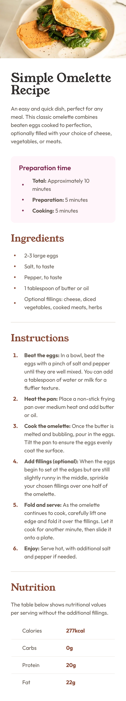

# Frontend Mentor - Recipe page solution

This is a solution to the [Recipe page challenge on Frontend Mentor](https://www.frontendmentor.io/challenges/recipe-page-KiTsR8QQKm). Frontend Mentor challenges help you improve your coding skills by building realistic projects.

## Table of contents

- [The challenge](#the-challenge)
- [Screenshots](#screenshots)
  - [1. Desktop version](#1-desktop-version)
  - [2. Tablet version](#2-tablet-version)
  - [3. Mobile version](#3-mobile-version)
- [Page speed insights](#page-speed-insights)
- [Links](#links)
- [My process](#my-process)
  - [Built with](#built-with)
  - [Tested with](#tested-with)
  - [What I learned](#what-i-learned)
- [Acknowledgement](#acknowledgement)
- [Author](#author)

## The challenge

This challenge will help one focus on writing semantic HTML. Ensure to think through what HTML elements are most appropriate for each piece of content.

## Screenshots

### 1. Desktop version


### 2. Tablet version


### 3. Mobile version



## Page speed insights

[Mobile version](https://pagespeed.web.dev/analysis/https-rupali317-github-io-recipe-page-main/nw58oxi22w?use_original_url=true&form_factor=mobile)

[Desktop version](https://pagespeed.web.dev/analysis/https-rupali317-github-io-recipe-page-main/nw58oxi22w?use_original_url=true&form_factor=desktop)

## Links

- Solution URL: [Recipe page Github solution](https://github.com/rupali317/recipe-page-main)
- Live Site URL: [Recipe page live URL](https://rupali317.github.io/recipe-page-main/)

## My process

### Built with

- Semantic HTML5 markup
- CSS custom properties
- Flexbox
- Mobile-first workflow
- [Github Pages](https://pages.github.com/) - Allows to host static websites directly from a GitHub repository.

### Tested with

- Browsers used for testing: Google Chrome, Firefox, Safari, Brave, Microsoft Edge.
- Devices:
  - (Real) MacBook Pro (14-inch), Samsung Galaxy A33 5G, Samsung Galaxy S20+, iPad Air (13-inch), MacBook Pro (13-inch).
  - (Virtual) The mobile and tablet devices mentioned under Chrome's dev console.
- Screen reader: MacOS VoiceOver.

### What I learned

- I faced a dilemma where for the heading of the pink section had a different styling than the rest of `<h2>`. I had to choose if I should use `<h2>` or if I should use `<div role="heading" aria-level="2">`. Using `<h2>` meant I had to use a customised styling for it since it was different from other `<h2>` and normally the expectation is that the look and feel of the heading level should be consistent according to a test from accessibility insights. Using the `<div>` version could have passed the particular test related to consistent styling for headings. Ultimately, I decided to use `<h2>` and added a customised styling for it since it is a better option for accessibility than a using a `<div>`.

- The `::marker` is not a child of the list elemnent. It is just a part of how the browser renders the list item. Therefore, adding a `display:flex` on the list item will not turn the `::marker` into a flex-item. In fact, it disappears.

- Center aligning the bullets and text especially for mobile view. The `::marker` does not support CSS properties like padding, margin, or position. Therefore, I applied `list-style: none` for `ul` and applied the following:

```css
li:before {
  content: "•";
  font-size: x-large;
  color: var(--color-secondary-2);
}
```

## Acknowledgement

- In all my projects, I always refer to CSS reset to provide a clean/consistent slate for the CSS stylings across all the browsers. [Joshua's CSS reset](https://www.joshwcomeau.com/css/custom-css-reset/), [Andy Bell's CSS reset](https://piccalil.li/blog/a-more-modern-css-reset/)

## Author

- Linkedin profile - [Rupali Roy Choudhury](https://www.linkedin.com/in/rupali-rc/)
- Frontend Mentor - [@rupali317](https://www.frontendmentor.io/profile/rupali317)
